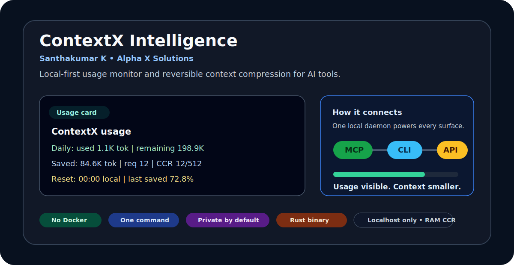
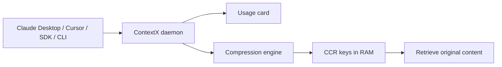
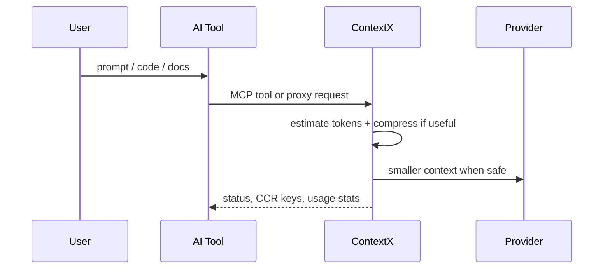
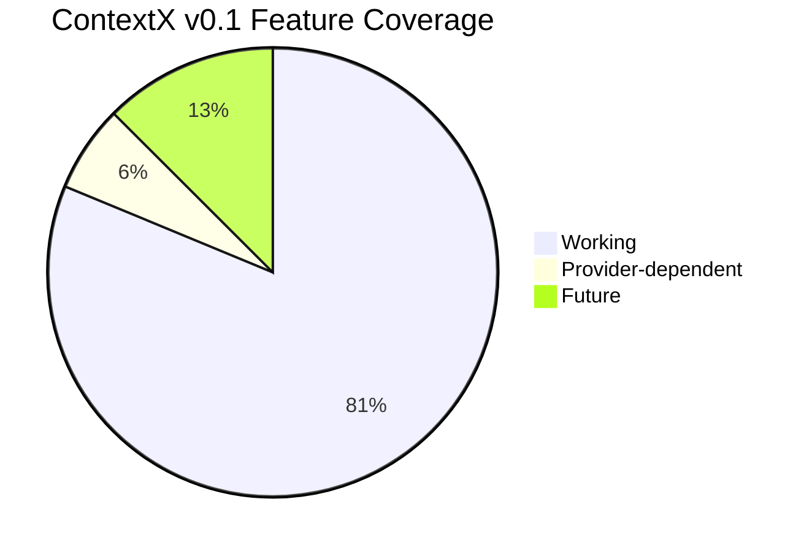

# ContextX Intelligence

**By Santhakumar K • Alpha X Solutions**

[](https://www.rust-lang.org/)
[](https://modelcontextprotocol.io/)
[](#privacy-and-safety)
[](#fast-setup)

Local-first **Claude usage monitor + context token saver** for AI tools.

ContextX is a single Rust CLI binary that helps AI users see usage and save tokens at the same time. It combines Claude Usage Monitor-style live usage visibility with reversible context compression, MCP tools, localhost proxy support, CLI wrapping, and safe auto-configuration.



No Docker. No telemetry. No cloud server. Memory-only by default.

## What You Get

| Need | ContextX gives you |
| --- | --- |
| Claude Desktop usage view | Tiny `contextx_status` MCP card inside chat |
| Terminal dashboard | `contextx status` or live `contextx tui` |
| Token saver | Reversible compression with CCR retrieval keys |
| Easy setup | `contextx setup --all` configures supported tools |
| Privacy | Localhost-only, no telemetry, no prompt database |



## Fast Setup

### Already Installed Locally

You already ran setup successfully. After pulling new changes, refresh the installed binary with:

```bash
cd ~/Desktop/Projects/heatroom
git pull
cargo run -- setup --all
contextx daemon
```

Open another terminal:

```bash
contextx status
contextx tui
```

### Fresh Setup From Source

```bash
git clone https://github.com/SanthaKumar-K-2004/ContextX-Intelligence.git
cd ContextX-Intelligence
cargo run -- setup --all
contextx daemon
```

That one setup command installs `contextx` into `~/.local/bin`, adds it to PATH when needed, backs up existing config files, and configures supported MCP clients.

Setup one tool only:

```bash
cargo run -- setup --client claude-desktop
cargo run -- setup --client cursor
cargo run -- setup --client vscode
cargo run -- setup --client zed
```

Preview first without changing files:

```bash
cargo run -- setup --all --dry-run
```

After setup, use normal commands:

```bash
contextx daemon
contextx status
contextx tui
```

## UI Preview

Terminal:

```text
ContextX usage
Daily: used 1070 tok | quota not set | remaining not set
Saved: 0 tok | req 1 | CCR 0/512
Reset: 00:00 local | last claude-desktop saved 0.0%
```

Claude Desktop:

```text
Use contextx_status and show my current ContextX usage briefly.
```

Claude Desktop can show the usage card as an MCP tool result. It cannot permanently draw a custom bar under the message box through MCP alone.

## Install Options

### Option 1: Install With Cargo

Use this if Rust/Cargo is installed:

```bash
cargo install --git https://github.com/SanthaKumar-K-2004/ContextX-Intelligence.git
contextx setup --all
```

Then verify:

```bash
contextx doctor
```

### Option 2: Build From Source

```bash
git clone https://github.com/SanthaKumar-K-2004/ContextX-Intelligence.git
cd ContextX-Intelligence
cargo run -- setup --all
```

Run with Cargo during development:

```bash
cargo run -- doctor
```

Run the built binary:

```bash
./target/release/contextx doctor
```

### Future One-Line Installers

ContextX is a Rust system tool, so the best packaging order is:

| Stage | Package Channel | User Command | Why |
| --- | --- | --- | --- |
| Now | GitHub + Cargo | `cargo install --git https://github.com/SanthaKumar-K-2004/ContextX-Intelligence.git` | Fastest real install for Rust users |
| Next | GitHub Releases | `curl -fsSL .../install.sh \| sh` | Best for normal users, no Rust required |
| Later | Homebrew | `brew install contextx` | Best macOS/Linux developer install |
| Later | npm wrapper | `npm install -g contextx-intelligence` | Good for JS/Node users; wrapper downloads the Rust binary |
| Later | PyPI wrapper | `pipx install contextx-intelligence` | Good for Python users; wrapper downloads the Rust binary |
| Later | Windows Scoop | `scoop install contextx` | Clean Windows install |

Recommended product strategy: keep the core as one Rust binary and use npm/PyPI only as installer wrappers. That keeps ContextX fast, low-RAM, and easy to ship.

## Quick Start After Setup

1. Check your machine:

```bash
contextx doctor
```

2. Preview setup changes:

```bash
contextx setup --all --dry-run
```

3. Apply safe setup:

```bash
contextx setup --all
```

4. Start the shared local engine:

```bash
contextx daemon
```

5. Open the dashboard in another terminal:

```bash
contextx tui
```

## How ContextX Runs

Most users run this while using AI tools:

```bash
contextx daemon
```

The daemon is the shared local brain. It keeps the in-memory CCR cache, usage counters, compression events, and local API alive.

Then connect tools in one of three ways:

| Connection | Best For | Command |
| --- | --- | --- |
| MCP | Claude Desktop, Cursor, Cline, Continue, Zed | `contextx mcp` via client config |
| Proxy | SDK apps, LangChain, Vercel AI SDK, custom apps | `contextx proxy --port 8787` |
| Wrapper | Claude Code, Codex CLI, Aider | `contextx wrap <command>` |



## Setup By Tool

| Tool | One-command setup | Where usage appears | Best command after setup |
| --- | --- | --- | --- |
| Claude Desktop | `contextx setup --client claude-desktop` | Inside chat via `contextx_status` | `contextx daemon` |
| Cursor | `contextx setup --client cursor` | MCP tool result + terminal | `contextx daemon` |
| VS Code / Cline / Continue | `contextx setup --client vscode` | MCP tool result + terminal | `contextx daemon` |
| Zed | `contextx setup --client zed` | MCP tool result + terminal | `contextx daemon` |
| Claude Code | `contextx wrap claude` | Terminal beside Claude Code | `contextx tui` |
| SDK apps | proxy env var | API stats + terminal | `contextx proxy --port 8787` |

### Claude Desktop

One-command setup:

```bash
contextx setup --client claude-desktop
```

Verify:

```bash
contextx verify-client --client claude-desktop
```

Run ContextX:

```bash
contextx daemon
```

Restart Claude Desktop after install. The MCP server name is `contextx`.

Inside Claude Desktop, ask the MCP tool for a tiny usage card:

```text
Use contextx_status and show my current ContextX usage briefly.
```

Claude Desktop does not allow ContextX to permanently draw a custom bar under the message box in v1. The supported in-app view is a short MCP tool result. Use `contextx_status` for the small card; use `contextx_stats` only when you want full JSON/debug details.

Expected card:

```text
ContextX usage
Daily: used 1070 tok | quota not set | remaining not set
Saved: 0 tok | req 1 | CCR 0/512
Reset: 00:00 local | last claude-desktop saved 0.0%
```

### Cursor

One-command setup:

```bash
contextx setup --client cursor
```

Verify:

```bash
contextx verify-client --client cursor
```

Run ContextX:

```bash
contextx daemon
```

Inside Cursor, use the `contextx_status` MCP tool for the short usage card. For always-visible monitoring, keep `contextx tui` open in another terminal.

### VS Code / Cline / Continue

One-command setup:

```bash
contextx setup --client vscode
```

Verify:

```bash
contextx verify-client --client vscode
```

Run ContextX:

```bash
contextx daemon
```

VS Code-style config uses a `servers` section instead of `mcpServers`.

### Zed

One-command setup:

```bash
contextx setup --client zed
```

Verify:

```bash
contextx verify-client --client zed
```

Run ContextX:

```bash
contextx daemon
```

### Claude Code

Run Claude through the safe wrapper:

```bash
contextx daemon
contextx wrap claude
```

For live usage beside Claude Code, open another terminal:

```bash
contextx tui
```

Wrapper mode tracks the process, but exact token usage is only available when requests flow through ContextX MCP or proxy.

### Codex CLI

Run Codex through the safe wrapper:

```bash
contextx daemon
contextx wrap codex
```

### Aider

Run Aider through the safe wrapper:

```bash
contextx daemon
contextx wrap aider
```

### OpenAI SDK / LangChain / Vercel AI SDK

Start the proxy:

```bash
contextx proxy --port 8787
```

Point your app to ContextX:

```bash
export OPENAI_BASE_URL=http://127.0.0.1:8787/v1
```

Then your OpenAI-compatible app sends requests through ContextX first. ContextX compresses only when it can reduce tokens without adding overhead.

### Dashboard

```bash
contextx daemon
contextx tui
```

Short non-refreshing table:

```bash
contextx status
```

### Stats

```bash
contextx stats
contextx stats --watch
```

Use `contextx status` for humans. Use `contextx stats` for full JSON automation/debugging.

## Verify Everything Works

Run these after setup:

```bash
contextx doctor
contextx setup --all --dry-run
contextx print-config --client claude-desktop
contextx verify-client --client claude-desktop
contextx stats
```

For a local API smoke test:

```bash
contextx daemon
```

In another terminal:

```bash
curl -s http://127.0.0.1:8787/health
```

Expected response includes:

```json
{
  "ok": true,
  "service": "contextx",
  "privacy": "memory-only"
}
```

## What Works Today

| Feature | Status |
| --- | --- |
| Single Rust CLI binary | Working |
| MCP server | Working |
| MCP tools | Working |
| Local daemon | Working |
| Local API | Working |
| OpenAI/Anthropic-style proxy routes | Working locally |
| TUI dashboard | Working |
| Stats watch | Working |
| One-command setup | Working |
| Auto config dry-run | Working |
| Safe config backup before edits | Working |
| Context compression | Working |
| CCR original retrieval | Working |
| Short-prompt no-overhead guard | Working |
| Claude account quota exact tracking | Provider-dependent |
| Deep Claude Code request interception | Future |
| npm/PyPI/Homebrew packages | Future wrappers |



## What ContextX Shows

```text
ContextX usage
Daily: used 18.5K tok | quota 200K tok | remaining 181.5K tok
Saved: 84.6K tok | req 12 | CCR 12/512
Reset: 00:00 local | last claude-desktop saved 72.8%
```

ContextX can only measure and save traffic it can see through MCP, proxy, wrapper, or direct CLI calls. Exact Claude account quota depends on what Claude exposes to local tools.

Set a local quota estimate if you want daily remaining tokens. Put this in your shell before starting the daemon:

```bash
export CONTEXTX_DAILY_TOKEN_QUOTA=200000
contextx daemon
```

Then check:

```bash
contextx status
```

Without this value, ContextX shows usage and savings but labels provider quota as estimated/not configured.

## Architecture

```text
┌──────────────────────────────────────────────────────────────────────────────┐
│                         CONTEXTX INTELLIGENCE                               │
│                         Santhakumar K • Alpha X Solutions                    │
│                                                                              │
│  Single local Rust binary: contextx                                          │
│  No Docker • No telemetry • Memory-only by default • Localhost-only API       │
└──────────────────────────────────────────────────────────────────────────────┘
                                      │
                                      ▼
┌──────────────────────────────────────────────────────────────────────────────┐
│ contextx daemon                                                              │
│ Shared local brain on 127.0.0.1:8787                                         │
│                                                                              │
│  ┌────────────────────┐  ┌────────────────────┐  ┌────────────────────┐     │
│  │ Compression Engine │  │ Usage Monitor      │  │ CCR Memory Cache   │     │
│  │ JSON / code / text │  │ session / weekly   │  │ originals in RAM   │     │
│  │ savings gate       │  │ burn rate / agents │  │ retrieve by key    │     │
│  └────────────────────┘  └────────────────────┘  └────────────────────┘     │
│                                                                              │
│  ┌────────────────────┐  ┌────────────────────┐  ┌────────────────────┐     │
│  │ Event Ring Buffer  │  │ Doctor / Installer │  │ Learning Observe   │     │
│  │ recent local stats │  │ safe config edits  │  │ suggestions only   │     │
│  └────────────────────┘  └────────────────────┘  └────────────────────┘     │
└──────────────────────────────────────────────────────────────────────────────┘
          ▲                    ▲                    ▲                    ▲
          │                    │                    │                    │
┌─────────┴─────────┐ ┌────────┴────────┐ ┌────────┴────────┐ ┌────────┴────────┐
│ MCP Mode          │ │ Proxy Mode      │ │ Wrapper Mode    │ │ CLI / TUI       │
│ contextx mcp      │ │ contextx proxy  │ │ contextx wrap   │ │ stats, doctor   │
│                   │ │                 │ │                 │ │ tui, install    │
│ Claude Desktop    │ │ OpenAI SDK      │ │ Claude Code     │ │ user dashboard  │
│ Cursor            │ │ Anthropic API   │ │ Codex CLI       │ │ setup checks    │
│ Cline             │ │ LangChain       │ │ Aider           │ │ safe config     │
│ Continue          │ │ Vercel AI SDK   │ │ other CLIs      │ │ verification    │
│ Zed               │ │ custom apps     │ │                 │ │                 │
└───────────────────┘ └─────────────────┘ └─────────────────┘ └─────────────────┘
```

## Tool Inventory

### MCP Tools

| Tool | What It Does | When To Use |
| --- | --- | --- |
| `contextx_compress` | Compresses messages and returns token savings + CCR keys | Before sending large context to an LLM |
| `contextx_retrieve` | Retrieves original content from RAM using CCR keys | When the model/client needs full details |
| `contextx_stats` | Returns full JSON usage, savings, cache, agent, provider, and learning status | Debugging and integrations |
| `contextx_status` | Shows a tiny usage card inside MCP clients | Claude Desktop, Cursor, Cline, Continue |
| `contextx_learn` | Returns observe-only tuning suggestions | Future auto-tuning workflow |

### CLI Commands

| Command | Purpose |
| --- | --- |
| `contextx daemon` | Shared local brain for MCP, proxy, stats, and TUI |
| `contextx mcp` | MCP stdio server for Claude Desktop, Cursor, Cline, Continue, Zed |
| `contextx proxy` | Local OpenAI/Anthropic-compatible proxy |
| `contextx wrap <command>` | Run terminal AI tools through ContextX tracking |
| `contextx tui` | Live terminal dashboard |
| `contextx stats` | Print full memory-only JSON stats |
| `contextx status` | Print a compact terminal usage table |
| `contextx setup` | Install ContextX locally, update PATH, configure clients, and verify |
| `contextx setup --all` | Setup all supported local clients |
| `contextx setup --client <client>` | Setup one supported client |
| `contextx doctor` | Check local setup |
| `contextx doctor --json` | Print machine-readable setup status |
| `contextx doctor --fix` | Apply safe auto-configuration |
| `contextx print-config --client <client>` | Print config without editing files |
| `contextx verify-client --client <client>` | Verify client config contains ContextX |
| `contextx install --client <client>` | Configure one supported client |
| `contextx install --all` | Configure all supported client configs |

## Manual MCP Config

Use this only if `contextx install --client ...` does not support your client yet.

Use this config shape:

```json
{
  "mcpServers": {
    "contextx": {
      "command": "/absolute/path/to/contextx",
      "args": ["mcp"]
    }
  }
}
```

For VS Code-style clients:

```json
{
  "servers": {
    "contextx": {
      "command": "/absolute/path/to/contextx",
      "args": ["mcp"]
    }
  }
}
```

## Local API

When `contextx daemon` or `contextx proxy` is running:

```text
GET  /health
GET  /stats
GET  /v1/contextx/stats
POST /v1/contextx/compress
POST /v1/contextx/retrieve
POST /v1/contextx/learn
```

Proxy-compatible routes:

```text
POST /v1/chat/completions
POST /v1/messages
POST /v1/responses
```

Example compress request:

```bash
curl -s http://127.0.0.1:8787/v1/contextx/compress \
  -H 'content-type: application/json' \
  -d '{
    "messages": [
      {"role": "user", "content": "large context here"}
    ],
    "agent": "curl",
    "provider": "local-test"
  }'
```

## Privacy And Safety

Default behavior:

- No Docker.
- No telemetry.
- No cloud service.
- No prompt history database.
- CCR originals are stored only in process RAM.
- Stats store counts, hashes, timing, model, provider, agent, and project metadata.
- HTTP services bind to `127.0.0.1` by default.
- Non-localhost binding is blocked unless `--allow-non-localhost` is explicitly passed.

Important limit:

Prompts still go to the AI provider selected by your client or proxy upstream. ContextX protects its own local processing; it does not make third-party providers private.

## Safe Auto-Configuration

ContextX edits config carefully:

- Reads existing JSON.
- Keeps existing settings.
- Keeps other MCP servers.
- Adds only the `contextx` server entry.
- Creates a backup before editing existing files.

Example before:

```json
{
  "mcpServers": {
    "github": {
      "command": "github-mcp"
    }
  }
}
```

After:

```json
{
  "mcpServers": {
    "github": {
      "command": "github-mcp"
    },
    "contextx": {
      "command": "/absolute/path/to/contextx",
      "args": ["mcp"]
    }
  }
}
```

## Development

```bash
cargo fmt --check
cargo test
cargo run -- doctor
cargo run -- mcp
cargo run -- proxy --port 8787
```

## Project Identity

Project: **ContextX Intelligence**

Creator: **Santhakumar K**

Company: **Alpha X Solutions**

Repository: <https://github.com/SanthaKumar-K-2004/ContextX-Intelligence>
